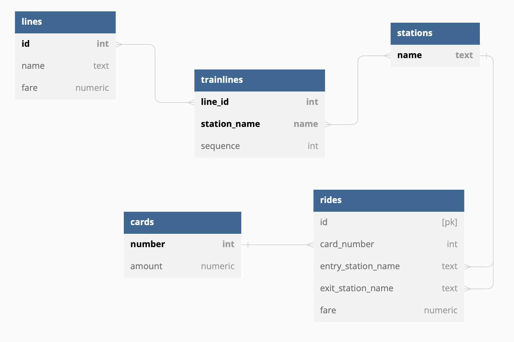

# Jayson's Submission for Parker Challenge

## Design

### Technologies

The API was built using Node.js (TypeScript), Express and PostgreSQL.

### Backend Layer

The backend was divided into the following layers:

* **controller**: handle request params and return appropriate response
* **service**: handle all business logic required for each API call
* **repository**: handle the queries made to the database

For each of these layers, two separate modules are created for separate business purposes:
* **`route`**: this module handles all trainline and station logic as well as calculating optimal routes
* **`ride`**: this module handles all card and ride (enter/exit) logic

### Database Layer

The database design is shown in the following diagram.



The purpose of each table is:

* **lines**: store the train line's ID, name and fare
* **stations**: store the station's name
* **trainlines**: junction table to connect line and station, sequence is used to identify connecting stations
* **cards**: store the card's number and balance
* **rides**: table to store the ride's id, card number used for the ride, entry station, exit station and total cost of ride

## Docs

### Route Module

`POST` at `/train-line`
* params:
  * `name`: name of trainline
  * `station`: array of stations on trainline
* returns success message upon trainline creation, or error message otherwise

`GET` at `/route`
* params:
  * `origin`: name of entry station
  * `destination`: name of exit station
* returns ordered array of shortest route (least stops) from `origin` to `destination`, or error message otherwise

### Ride Module

`POST` at `/card`
* params:
  * `number`: unique number of card
  * `amount`: balance to add to card
* returns success message upon card creation, or error mesage otherwise
* note: if card exists in database, increment existing balance by `amount`

`POST` at `/station/:station/enter`
* params:
  * `:station`: name of entry station
  * `card_number`: unique number of card
* return current balance of card, or error message otherwise
* notes:
  * we cannot charge fare to card since we need exit station to determine total cost
  * an error is thrown if the card has balance < 0.00
  * an error is thrown if the card has already entered a station but not yet exited

`POST` at `/station/:station/exit`
* params:
  * `:station`: name of exit station
  * `card_number`: unique number of card
* return new/updated balance of card, or error message otherwise
* note: an error is thrown if the card has not yet entered a station

## Running

Enter the root directory of this project and run the following command.

```
docker-compose up --build
```

This will start up the respective docker containers for the Node/Express server as well as the Postgres database.

All HTTP requests can be now sent to `http://localhost:8080/`. To view the Postgres database, connect using the following credentials:

```
database: 'postgres'
user: 'postgres'
password: 'password'
```

## Testing

Once the server and database are running, an API testing tool should be used.

For the development of this project, Postman was used to send the POST and GET requests. Alternatively, cURL commands can also be used to verify correct API behaviour.

A sample test plan can be found [here](./testplan.md).


